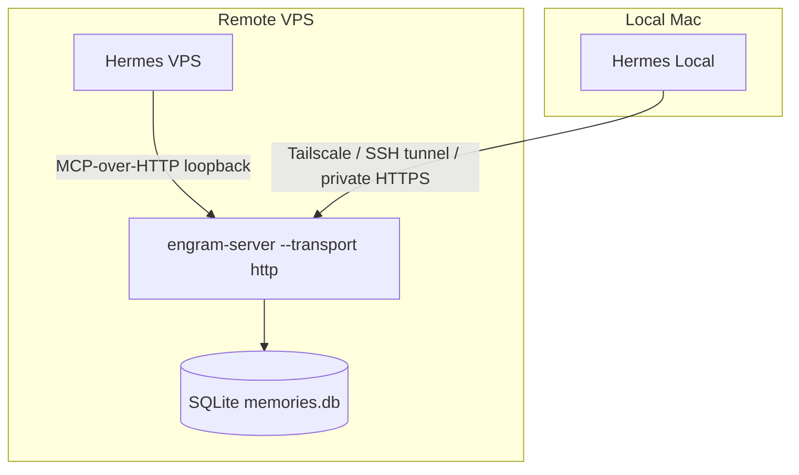

# Shared Memory Between Hermes Local and Hermes VPS Using Engram

Status: proposed architecture and implementation plan
Date: 2026-06-22
Audience: Engram maintainers, Hermes operators, and implementation agents

## Executive Decision

Use Engram as the shared external memory provider for both Hermes environments.

Recommended architecture:

- One centralized `engram-server` on the VPS.
- MCP-over-HTTP transport protected by a Bearer token.
- Hermes VPS connects over loopback.
- Hermes Local connects over Tailscale, an SSH tunnel, or a private HTTPS reverse proxy.
- Built-in Hermes memory files remain local and are not synced.
- Durable shared memory is stored in a shared Engram workspace.
- Machine-specific context is isolated by agent-specific scope paths.

Do not use direct SQLite replication or direct `~/.hermes/memories/` sync between machines.

The correct product description is:

> Both Hermes instances share a durable model of the user through the same Engram workspace, while machine-specific memory remains isolated by scope and agent identity.

## Why Engram Fits

Engram already provides the core primitives needed for this design:

- MCP transport for memory reads and writes.
- Streamable HTTP transport at `/mcp` and `/v1/mcp`.
- Optional HTTP Bearer-token authentication through `--http-api-key`.
- SQLite local-first storage with WAL.
- Workspace isolation.
- Hierarchical scope paths through `scope_set`, `scope_search`, and `scope_tree`.
- Hybrid retrieval through `memory_search`.
- Delta observation primitives through `sync_version`, `sync_delta`, and `sync_state`.

This means Engram can serve the same role that Honcho would serve in a multi-peer architecture, while keeping the memory layer self-hosted and under our control.

## Current Engram Reality Check

This section is intentionally strict. It separates what works today from what needs a small Engram follow-up.

### Works Today

- `engram-server --transport http --http-port 3100 --http-api-key ...` is supported.
- HTTP MCP accepts requests at both `/mcp` and `/v1/mcp`.
- When `--http-api-key` is set, requests without `Authorization: Bearer <token>` are rejected.
- `workspace` is supported on memory writes and searches.
- Hierarchical scope paths exist through:
  - `scope_set`
  - `scope_get`
  - `scope_list`
  - `scope_search`
  - `scope_tree`
- `scope_search` includes ancestor scopes and excludes sibling scopes.
- `sync_version`, `sync_delta`, and `sync_state` exist as MCP tools.

### Important Gaps

These gaps do not block centralized deployment, but they do affect the polished Hermes integration.

1. `memory_create` does not currently expose first-class `scope_path` in the generated MCP reference.
2. The current `memory_create` implementation stores legacy `scope_type` and `scope_id`, not hierarchical `scope_path`.
3. `scope_set` can assign hierarchical scope after creation, so current production usage is a two-step write.
4. `scope_search` has the desired ancestor visibility semantics, but it is substring search and returns memory IDs, not full hybrid-ranked results.
5. `memory_search` is the high-quality hybrid retriever, but its current `scope_path` behavior is descendant-prefix filtering, not "agent sees exact scope plus ancestors".
6. The database layer does not universally reject secret-looking content. A no-secrets rule must be enforced by Hermes policy or by an Engram write guard.
7. Delta sync tools are useful for observation, but they are not a complete bidirectional replication product by themselves.

Conclusion:

- Centralized Engram server: yes, use it.
- Hierarchical isolation: yes, but use `scope_set` today.
- Full inherited hybrid retrieval: add a small Engram contract improvement before relying on it as the default Hermes prefetch path.
- Decentralized delta sync: defer.

## Target Architecture



## Identity and Memory Boundaries

Use one Engram workspace and two Hermes agent identities.

| Concept | Value |
| --- | --- |
| Engram workspace | `ronaldo` |
| Shared user identity | `ronaldo` |
| Local Hermes agent | `hermes-local` |
| VPS Hermes agent | `hermes-vps` |
| Default org segment | `org:default` |
| Default session segment | `session:default` |

Recommended hierarchical scope paths:

| Memory class | Scope path |
| --- | --- |
| Shared user memory | `global/org:default/user:ronaldo` |
| Hermes Local memory | `global/org:default/user:ronaldo/session:default/agent:hermes-local` |
| Hermes VPS memory | `global/org:default/user:ronaldo/session:default/agent:hermes-vps` |

## Visibility Semantics

Desired semantics for Hermes:

| Querying scope | Visible memories |
| --- | --- |
| `global/org:default/user:ronaldo/session:default/agent:hermes-local` | Global, org, user, session, and exact `hermes-local` memories |
| `global/org:default/user:ronaldo/session:default/agent:hermes-vps` | Global, org, user, session, and exact `hermes-vps` memories |

Not visible:

- Hermes Local must not see exact Hermes VPS agent memory.
- Hermes VPS must not see exact Hermes Local agent memory.
- Shared user memory must not include secrets or machine-specific operational state.

## Memory Classes

### Shared User Memory

Allowed:

- Communication preferences.
- Stable user workflows.
- Durable project context.
- Reusable technical decisions.
- Preferred tooling patterns.
- Non-sensitive operating principles.
- High-level architecture decisions.

Examples:

- The user prefers implementation plans with explicit validation and rollback steps.
- The user uses Engram as the memory backend for agent harness work.
- The user wants secrets excluded from durable shared memory.

### Hermes Local Memory

Allowed:

- Mac file paths.
- Local project directories.
- Local shell setup.
- Desktop workflows.
- Local development tooling.
- Mac-specific troubleshooting notes.

Examples:

- Hermes Local manages local files, code, editor workflows, and desktop automation.
- A local project path exists on the Mac and must not be treated as a VPS path.

### Hermes VPS Memory

Allowed:

- Server-side process state.
- Systemd services.
- Cron jobs.
- Webhooks.
- Telegram or automation bots.
- VPS deployment paths.
- Long-running server workflows.

Examples:

- Hermes VPS manages server-side automations and long-running services.
- A VPS service path exists only on the remote server.

### Never Store

Never store these in shared memory or agent-specific Engram memory:

- API keys.
- Passwords.
- OAuth tokens.
- SSH private keys.
- Recovery codes.
- Raw `.env` values.
- Database URLs with credentials.
- Private customer data unless explicitly approved and minimized.
- Full raw logs containing secrets.

## Recommended Implementation Phases

## Phase 0: Confirm Hermes Integration Surface

Goal:

Determine how Hermes will call Engram.

Questions:

- Does Hermes already support generic MCP-over-HTTP memory providers?
- Does Hermes require a named provider plugin?
- Can Hermes send custom JSON-RPC payloads to `/v1/mcp`?
- Can Hermes attach `Authorization: Bearer <token>` headers?
- Can Hermes distinguish user-level and agent-level writes?

Decision:

- If Hermes supports generic MCP-over-HTTP, configure it directly.
- If Hermes only supports named providers such as Honcho or Mem0, implement a small Engram provider adapter.
- Do not reshape Engram to mimic Honcho naming internally. Keep Engram concepts explicit: workspace, memory, scope path, MCP tool.

Deliverable:

- A short note documenting the Hermes memory provider integration mode.

## Phase 1: Deploy Central Engram Server on VPS

Build:

```bash
cargo build --release
```

Recommended runtime environment file:

```bash
# /etc/engram/hermes-memory.env
ENGRAM_DB_PATH=/var/lib/engram/hermes-memory.db
ENGRAM_TRANSPORT=http
ENGRAM_HTTP_PORT=3100
ENGRAM_HTTP_API_KEY=replace_with_secure_token
ENGRAM_EMBEDDING_MODEL=tfidf
ENGRAM_HTTP_RATE_LIMIT_RPS=120
ENGRAM_HTTP_RATE_LIMIT_BURST=240
```

Permissions:

```bash
sudo install -d -m 700 -o engram -g engram /var/lib/engram
sudo install -d -m 700 -o root -g root /etc/engram
sudo chmod 600 /etc/engram/hermes-memory.env
```

Manual run:

```bash
set -a
. /etc/engram/hermes-memory.env
set +a

./target/release/engram-server \
  --transport http \
  --http-port "$ENGRAM_HTTP_PORT" \
  --http-api-key "$ENGRAM_HTTP_API_KEY" \
  --db-path "$ENGRAM_DB_PATH" \
  --embedding-model "$ENGRAM_EMBEDDING_MODEL"
```

Systemd unit:

```ini
[Unit]
Description=Engram shared memory server for Hermes
After=network-online.target
Wants=network-online.target

[Service]
User=engram
Group=engram
EnvironmentFile=/etc/engram/hermes-memory.env
WorkingDirectory=/opt/engram
ExecStart=/opt/engram/target/release/engram-server \
  --transport http \
  --http-port ${ENGRAM_HTTP_PORT} \
  --http-api-key ${ENGRAM_HTTP_API_KEY} \
  --db-path ${ENGRAM_DB_PATH} \
  --embedding-model ${ENGRAM_EMBEDDING_MODEL}
Restart=always
RestartSec=5
NoNewPrivileges=true
PrivateTmp=true

[Install]
WantedBy=multi-user.target
```

Important:

Current Engram HTTP transport binds `0.0.0.0:{port}`. Until Engram grows a `--http-bind` flag, protect the port with firewall, Tailscale ACLs, SSH tunneling, or a private reverse proxy. Do not expose `3100` publicly.

## Phase 2: Secure Network Access

Preferred options, in order:

1. Tailscale private network.
2. SSH local tunnel.
3. HTTPS reverse proxy restricted by firewall and Bearer auth.

### Tailscale Option

VPS:

```bash
sudo ufw deny 3100/tcp
sudo ufw allow in on tailscale0 to any port 3100 proto tcp
```

Mac endpoint:

```text
http://<vps-tailscale-ip>:3100/v1/mcp
```

### SSH Tunnel Option

Mac:

```bash
ssh -N -L 3100:127.0.0.1:3100 user@vps-host
```

Hermes Local endpoint:

```text
http://127.0.0.1:3100/v1/mcp
```

### Reverse Proxy Option

Use only if Tailscale or SSH tunnel is not suitable.

Requirements:

- HTTPS.
- Firewall restricts origin IPs where possible.
- Engram Bearer auth remains enabled.
- No logs containing Authorization headers.
- Request body logging disabled.

## Phase 3: Configure Hermes VPS

Endpoint:

```text
http://127.0.0.1:3100/v1/mcp
```

Headers:

```text
Authorization: Bearer <ENGRAM_HTTP_API_KEY>
Content-Type: application/json
```

Identity settings:

```yaml
workspace: ronaldo
user: ronaldo
agent: hermes-vps
agent_scope_path: global/org:default/user:ronaldo/session:default/agent:hermes-vps
shared_user_scope_path: global/org:default/user:ronaldo
```

## Phase 4: Configure Hermes Local

Endpoint when using Tailscale:

```text
http://<vps-tailscale-ip>:3100/v1/mcp
```

Endpoint when using SSH tunnel:

```text
http://127.0.0.1:3100/v1/mcp
```

Headers:

```text
Authorization: Bearer <ENGRAM_HTTP_API_KEY>
Content-Type: application/json
```

Identity settings:

```yaml
workspace: ronaldo
user: ronaldo
agent: hermes-local
agent_scope_path: global/org:default/user:ronaldo/session:default/agent:hermes-local
shared_user_scope_path: global/org:default/user:ronaldo
```

## Phase 5: Current Engram Write Flow

Until `memory_create` accepts first-class `scope_path`, use a two-step write:

1. Create the memory.
2. Assign the hierarchical scope with `scope_set`.

### Create Shared User Memory

```json
{
  "jsonrpc": "2.0",
  "id": 1,
  "method": "tools/call",
  "params": {
    "name": "memory_create",
    "arguments": {
      "content": "The user prefers implementation plans with explicit validation steps and rollback instructions.",
      "memory_type": "preference",
      "workspace": "ronaldo",
      "tags": ["boundary:shared-user", "source:hermes"],
      "metadata": {
        "memory_boundary": "shared_user",
        "user": "ronaldo"
      }
    }
  }
}
```

Then scope the returned memory ID:

```json
{
  "jsonrpc": "2.0",
  "id": 2,
  "method": "tools/call",
  "params": {
    "name": "scope_set",
    "arguments": {
      "memory_id": 123,
      "scope_path": "global/org:default/user:ronaldo"
    }
  }
}
```

### Create Hermes Local Memory

```json
{
  "jsonrpc": "2.0",
  "id": 3,
  "method": "tools/call",
  "params": {
    "name": "memory_create",
    "arguments": {
      "content": "Hermes Local handles Mac files, local code, editor workflows, and desktop automation.",
      "memory_type": "context",
      "workspace": "ronaldo",
      "tags": ["boundary:agent-local", "agent:hermes-local", "source:hermes"],
      "metadata": {
        "memory_boundary": "agent",
        "agent": "hermes-local"
      }
    }
  }
}
```

Then:

```json
{
  "jsonrpc": "2.0",
  "id": 4,
  "method": "tools/call",
  "params": {
    "name": "scope_set",
    "arguments": {
      "memory_id": 124,
      "scope_path": "global/org:default/user:ronaldo/session:default/agent:hermes-local"
    }
  }
}
```

### Create Hermes VPS Memory

```json
{
  "jsonrpc": "2.0",
  "id": 5,
  "method": "tools/call",
  "params": {
    "name": "memory_create",
    "arguments": {
      "content": "Hermes VPS handles server workflows, cron jobs, webhooks, and long-running automations.",
      "memory_type": "context",
      "workspace": "ronaldo",
      "tags": ["boundary:agent-vps", "agent:hermes-vps", "source:hermes"],
      "metadata": {
        "memory_boundary": "agent",
        "agent": "hermes-vps"
      }
    }
  }
}
```

Then:

```json
{
  "jsonrpc": "2.0",
  "id": 6,
  "method": "tools/call",
  "params": {
    "name": "scope_set",
    "arguments": {
      "memory_id": 125,
      "scope_path": "global/org:default/user:ronaldo/session:default/agent:hermes-vps"
    }
  }
}
```

## Phase 6: Current Engram Read Flow

There are two read modes today.

### Mode A: Correct Scope Visibility, Lower Retrieval Quality

Use `scope_search` for exact agent-plus-ancestor visibility.

```json
{
  "jsonrpc": "2.0",
  "id": 7,
  "method": "tools/call",
  "params": {
    "name": "scope_search",
    "arguments": {
      "query": "preferred provider",
      "scope_path": "global/org:default/user:ronaldo/session:default/agent:hermes-local"
    }
  }
}
```

This returns IDs. Then fetch each memory with `memory_get`.

Pros:

- Correct ancestor behavior.
- Excludes sibling agent scopes.

Cons:

- Substring search only.
- No hybrid BM25/vector ranking.
- Requires follow-up `memory_get` calls.

### Mode B: Better Retrieval Quality, Needs Tag Discipline

Use `memory_search` for agent-specific memory plus a separate shared-user search constrained by tags.

Agent-specific query:

```json
{
  "jsonrpc": "2.0",
  "id": 8,
  "method": "tools/call",
  "params": {
    "name": "memory_search",
    "arguments": {
      "query": "workspace folder",
      "workspace": "ronaldo",
      "scope_path": "global/org:default/user:ronaldo/session:default/agent:hermes-local",
      "tags": ["agent:hermes-local"],
      "limit": 10
    }
  }
}
```

Shared-user query:

```json
{
  "jsonrpc": "2.0",
  "id": 9,
  "method": "tools/call",
  "params": {
    "name": "memory_search",
    "arguments": {
      "query": "workspace folder",
      "workspace": "ronaldo",
      "scope_path": "global/org:default/user:ronaldo",
      "tags": ["boundary:shared-user"],
      "limit": 10
    }
  }
}
```

Pros:

- Uses hybrid retrieval.
- Works with current `memory_search`.

Cons:

- Relies on strict tagging to avoid descendant/sibling leakage.
- Not as clean as first-class inherited scope semantics.

Recommendation:

- Use Mode B only as a temporary bridge.
- Implement first-class inherited hybrid search before making this the default long-term Hermes behavior.

## Phase 7: Engram Follow-Up PR

Goal:

Make the Hermes shared-memory architecture first-class in Engram.

### Required Contract Changes

Add `scope_path` to `memory_create`:

```json
{
  "content": "The user prefers concise plans.",
  "memory_type": "preference",
  "workspace": "ronaldo",
  "scope_path": "global/org:default/user:ronaldo"
}
```

Add explicit scope visibility mode to `memory_search`:

```json
{
  "query": "workspace folder",
  "workspace": "ronaldo",
  "scope_path": "global/org:default/user:ronaldo/session:default/agent:hermes-local",
  "scope_mode": "visible"
}
```

Recommended `scope_mode` values:

| Mode | Behavior |
| --- | --- |
| `exact` | Only memories exactly at `scope_path` |
| `descendants` | Memories at `scope_path` and below it |
| `visible` | Memories exactly at `scope_path` plus exact ancestors |

For Hermes, use:

```text
scope_mode = visible
```

Visible mode must include:

- `global`
- `global/org:default`
- `global/org:default/user:ronaldo`
- `global/org:default/user:ronaldo/session:default`
- exact agent path

Visible mode must exclude:

- sibling users
- sibling sessions
- sibling agents
- descendants below an ancestor that are not on the query path

### Implementation Notes

Keep compatibility:

- Do not remove legacy `scope`.
- Do not remove `scope_type` or `scope_id`.
- Do not break existing `memory_search` callers.
- Keep default search behavior unchanged unless `scope_mode` is provided.

Suggested code areas:

- `src/types.rs`
  - Add `scope_path: Option<String>` to create/search inputs if missing from public schema.
  - Add `scope_mode`.
- `src/storage/queries/core.rs`
  - Persist `scope_path` during create when provided.
- `src/search/hybrid.rs`
  - Apply the selected scope visibility mode consistently for keyword and semantic search.
- `src/search/bm25.rs`
  - Add exact ancestor-path filtering for `scope_mode=visible`.
- `src/mcp/tools/registry.rs`
  - Expose `scope_path` and `scope_mode` in MCP schemas.
- `docs/MCP_TOOLS.md`
  - Regenerate through the existing MCP reference generator.
- `tests/mcp_protocol_tests.rs`
  - Add protocol tests for create/search scope semantics.

### Required Tests

Test: create memory with `scope_path`

- Given a `memory_create` request with `scope_path`.
- When the memory is created.
- Then `scope_get` returns the same path.

Test: Hermes Local visible search

- Given shared user memory, local agent memory, and VPS agent memory.
- When searching from `agent:hermes-local` with `scope_mode=visible`.
- Then shared user and local agent memories are returned.
- Then VPS agent memory is not returned.

Test: Hermes VPS visible search

- Given shared user memory, local agent memory, and VPS agent memory.
- When searching from `agent:hermes-vps` with `scope_mode=visible`.
- Then shared user and VPS agent memories are returned.
- Then local agent memory is not returned.

Test: descendant mode remains available

- Given memories below a path.
- When searching with `scope_mode=descendants`.
- Then descendant memories are returned.

Test: default behavior remains compatible

- Given old callers without `scope_mode`.
- When using existing `memory_search`.
- Then response shape and broad behavior remain compatible.

## Phase 8: Secret Rejection Policy

Goal:

Prevent accidental persistence of secrets.

Minimum policy:

- Hermes must never intentionally write secrets to Engram.
- Engram should reject obvious secret-looking content for this deployment.

Recommended Engram write guard:

- Apply to:
  - `memory_create`
  - `memory_create_batch`
  - `memory_import`
  - `context_record`
  - document ingestion paths if enabled for Hermes
- Reject content matching high-confidence secret patterns:
  - `OPENAI_API_KEY=`
  - `AWS_SECRET_ACCESS_KEY=`
  - `DATABASE_URL=` with credentials
  - PEM private key blocks
  - SSH private key blocks
  - GitHub tokens
  - Telegram bot tokens
  - generic `*_TOKEN=` and `*_SECRET=` assignments
- Return structured error:
  - `secret_rejected: true`
  - pattern class, not the secret value
  - remediation hint

Do not log rejected secret values.

Operational rule:

- If a secret is accidentally stored, immediately delete the memory, rotate the secret, and record a sanitized incident note.

## Validation Checklist

### Server and Auth

- [ ] `GET /health` works from VPS.
- [ ] `POST /v1/mcp` without Bearer token returns unauthorized.
- [ ] `POST /v1/mcp` with wrong Bearer token returns unauthorized.
- [ ] `POST /v1/mcp` with correct Bearer token succeeds.
- [ ] Port `3100` is not publicly reachable outside the approved private path.
- [ ] Request logs do not include Authorization headers.

### Shared Memory

- [ ] Hermes Local writes a shared user memory.
- [ ] Hermes VPS retrieves that shared user memory.
- [ ] Hermes VPS writes a shared user memory.
- [ ] Hermes Local retrieves that shared user memory.

### Agent Isolation

- [ ] Hermes Local writes a local-only sentinel memory.
- [ ] Hermes Local can retrieve the local-only sentinel.
- [ ] Hermes VPS cannot retrieve the local-only sentinel as its own context.
- [ ] Hermes VPS writes a VPS-only sentinel memory.
- [ ] Hermes VPS can retrieve the VPS-only sentinel.
- [ ] Hermes Local cannot retrieve the VPS-only sentinel as its own context.

### Machine Context

- [ ] Mac paths are labelled Mac-local.
- [ ] VPS paths are labelled VPS-local.
- [ ] Hermes VPS does not treat Mac paths as executable server paths.
- [ ] Hermes Local does not treat VPS service paths as local files.

### Secret Handling

- [ ] API keys are not stored in Engram.
- [ ] `.env` contents are not stored in Engram.
- [ ] Secret-looking writes are rejected or manually blocked.
- [ ] No tokens appear in logs, docs, memory exports, or MCP traces.

### Failure Behavior

- [ ] If Engram is unavailable, Hermes continues operating without destructive failure.
- [ ] Hermes reports memory provider failure visibly.
- [ ] Local built-in Hermes memory remains local and usable.
- [ ] Re-enabling Engram does not duplicate large numbers of memories.

## Operational Rules

## Durable Only

Store only memory that is likely to remain useful.

Good:

- The user prefers direct engineering recommendations with validation steps.

Bad:

- The user is currently tired.

## Summaries Over Raw Logs

Good:

- The VPS deploy failed because port 8787 was already in use; the fix was to stop the conflicting process before restarting the service.

Bad:

- Full raw terminal output.

## Label Machine-Specific Facts

Good:

- Hermes Local has a Mac-specific project path for project X.

Bad:

- Project X is always at `/Users/ronaldo/dev/project-x`.

## Review and Prune

Cadence:

- Weekly during setup.
- Monthly after stable operation.

Review:

- stale memories
- wrong memories
- overly specific memories
- accidental machine leakage
- accidental sensitive data
- duplicate memories

## Backup and Restore

Back up the SQLite database before upgrades:

```bash
sqlite3 /var/lib/engram/hermes-memory.db ".backup '/var/backups/engram/hermes-memory-$(date +%Y%m%d-%H%M%S).db'"
```

Keep:

- daily backups for 7 days
- weekly backups for 4 weeks
- monthly backups for 6 months, if the memory becomes operationally critical

Restore procedure:

1. Stop `engram-server`.
2. Copy current DB aside.
3. Restore selected backup.
4. Start `engram-server`.
5. Run validation queries.
6. Only delete the old DB after validation.

## Rollback Plan

Use this if shared memory causes incorrect behavior, privacy risk, or instability.

1. Disable the external Engram memory provider in both Hermes instances.
2. Keep built-in local Hermes memory active.
3. Stop writes to shared Engram.
4. Export or inspect relevant Engram memories.
5. Delete sensitive or incorrect entries.
6. Rotate any secret that was stored.
7. Re-enable only after pruning and validation.

Do not delete local Hermes memory files as the first rollback step.

Rollback must be reversible.

## Option 2: Decentralized Delta Sync

Status: deferred.

Why it is not the default:

- It introduces conflict resolution.
- It requires a safe apply-delta workflow.
- It creates more operational states to debug.
- Engram's sync primitives exist, but they are not a complete bidirectional peer-replication product yet.

Current useful primitives:

- `sync_version`
- `sync_delta`
- `sync_state`
- `memory_events_poll`

Missing or not yet productized for this architecture:

- tested peer-to-peer apply-delta path
- conflict policy for concurrent edits
- deletion semantics across peers
- scope-aware replication filters
- idempotent replay guarantees across independent databases
- operational runbook for divergent versions

Decision:

- Do not start with decentralized sync.
- Revisit only if offline-first operation becomes a hard requirement.

## Acceptance Criteria

The implementation is complete when:

- [ ] Both Hermes instances use Engram as the shared external memory provider.
- [ ] Both use workspace `ronaldo`.
- [ ] Hermes Local identifies as `hermes-local`.
- [ ] Hermes VPS identifies as `hermes-vps`.
- [ ] Shared user memory is visible to both.
- [ ] Local agent memory is visible only to Hermes Local plus authorized shared layers.
- [ ] VPS agent memory is visible only to Hermes VPS plus authorized shared layers.
- [ ] No direct Hermes memory-file sync exists.
- [ ] No direct SQLite file sync exists.
- [ ] API keys are stored outside Git.
- [ ] Secret-looking content is rejected or blocked by policy.
- [ ] A documented rollback path exists.
- [ ] A memory review and pruning cadence exists.
- [ ] A backup and restore process exists.
- [ ] Validation tests prove sibling agent isolation.

## Implementation Prompt for Agents

Use this prompt for implementation agents:

```text
Implement shared long-term memory for Hermes Local and Hermes VPS using Engram.

Use one centralized Engram server on the VPS with MCP-over-HTTP and Bearer auth.
Do not sync ~/.hermes/memories directly.
Do not sync the SQLite database file between machines.

Workspace:
  ronaldo

Shared user scope:
  global/org:default/user:ronaldo

Hermes Local scope:
  global/org:default/user:ronaldo/session:default/agent:hermes-local

Hermes VPS scope:
  global/org:default/user:ronaldo/session:default/agent:hermes-vps

Current Engram supports hierarchical scope assignment through scope_set.
If first-class scope_path support is not yet implemented in memory_create,
create memories first and then call scope_set with the returned memory ID.

Before claiming done, validate:
1. Mac writes shared memory and VPS retrieves it.
2. VPS writes shared memory and Mac retrieves it.
3. Mac-local sentinel memory is not visible as VPS context.
4. VPS-only sentinel memory is not visible as Mac context.
5. No API keys, tokens, SSH keys, or .env secrets are stored.
6. Engram provider failure does not break basic Hermes operation.
7. Rollback is documented and reversible.

If implementing Engram code changes, add:
- scope_path to memory_create
- scope_mode=visible to memory_search
- MCP protocol tests proving shared ancestor visibility and sibling isolation
- regenerated docs/MCP_TOOLS.md
```

## Final Recommendation

Do this on Engram.

Use the centralized server first because it gives real-time consistency without database replication. Treat hierarchical scoping as the isolation model, but implement the small Engram follow-up that makes `scope_path` and inherited hybrid retrieval first-class before depending on it for automatic Hermes prefetch.

Do not describe the result as:

> Both Hermes instances know everything the other knows.

Describe it as:

> Both Hermes instances share durable user memory through Engram while preserving separate machine-specific context through agent-scoped boundaries.
