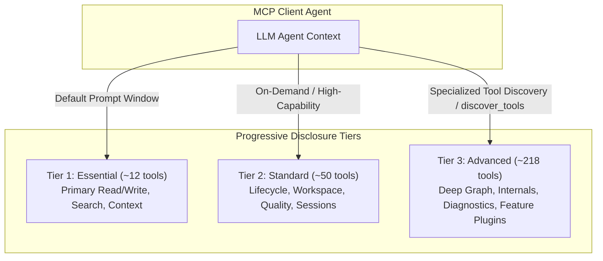

# MCP Tool Surface Consolidation Program (Phase 3a Specification)

**Status:** Proposed / Active  
**Author:** Engram Architecture Team  
**Date:** 2026-07-14  
**Target Scope:** `src/mcp/tools/` · `docs/MCP_TOOLS.md` · MCP Client Integration

---

## 1. Executive Summary

As Engram grew from a lightweight local memory store into a comprehensive multi-agent cognitive architecture, its MCP tool surface expanded to **280 tools**. 

While this breadth provides exhaustive coverage of memory storage, vector search, knowledge graphs, temporal evolution, session replay, and administrative controls, exposing 280 distinct tools in a flat registry poses cognitive overload for LLM agents, increases tool-selection token budgets, and complicates SDK surface maintenance.

This specification defines the **Phase 3a MCP Tool Surface Consolidation Architecture**:
1. **Tiered Progressive Disclosure**: Structured partitioning of tools into `Essential`, `Standard`, and `Advanced` tiers to minimize prompt context consumption.
2. **High-Leverage Facade Verbs**: Consolidating multiple single-purpose tools into unified, parameter-driven facade operations (e.g., parameterizing search strategies into `memory_search`).
3. **Backward-Compatible Alias Routing**: Preserving all existing tool names as non-breaking aliases throughout a formal deprecation lifecycle.

---

## 2. Current Surface Analysis (280 Tools Inventory)

The active MCP catalog partitions across the following primary functional domains:

| Domain Namespace | Tool Count | Core Capabilities |
|---|---|---|
| `memory.core` | ~38 | CRUD, bulk seeding, versioning, document ingestion, project context scanning |
| `memory.search` | ~32 | Hybrid vector + BM25 search, policy rerank, temporal query, graph traversal |
| `context` | ~8 | Context bundling, artifact recording, budget checks, session seed |
| `memory.graph` | ~45 | Entity links, triplet extraction, knowledge clustering, coactivation analysis |
| `memory.lifecycle`| ~24 | TTL expiration, importance scoring, promotion, decay, gardening, compaction |
| `memory.quality` | ~18 | Deduplication, conflict detection, contradiction reconciliation |
| `identity` | ~14 | Identity resolution, profile links, agent persona mapping |
| `session` | ~16 | Session turn tracking, checkpointing, working memory rotation |
| `workspace` | ~10 | Workspace isolation, cross-workspace migration, stats, scoping |
| `feature.*` | ~75 | Feature-gated capabilities (`dream-phase`, `multimodal`, `duckdb-graph`, `langfuse`) |

---

## 3. Tiered Progressive Disclosure Model

To optimize token efficiency for agents with constrained context windows, Engram implements a 3-tier exposure model:

### 3.1 Tier Definitions

1. **Essential Tier (Default Core)**:
   - Always exposed in default MCP initialization.
   - Includes: `memory_create`, `memory_get`, `memory_update`, `memory_search`, `context_build_bundle`, `context_search`, `workspace_list`, `discover_tools`.
2. **Standard Tier (Operational Automation)**:
   - Exposed to full-featured autonomous coding agents.
   - Includes: `memory_list`, `memory_delete`, `memory_promote`, `session_index`, `workspace_stats`, `identity_resolve`.
3. **Advanced Tier (Deep Introspection & Maintenance)**:
   - Accessible via dynamic discovery (`discover_tools`) or specialized task configurations.
   - Includes: raw graph pathfinding, AST chunking, engine diagnostics, embedding cache clearing.

---

## 4. Facade Consolidation Strategy

Rather than multiplying tool variants, related operations are unified into canonical verbs with optional configuration arguments:

### 4.1 Search Consolidation
- **Legacy variants**: `memory_search_hybrid`, `memory_search_semantic`, `memory_search_temporal`, `memory_search_with_policy`.
- **Unified Facade**: `memory_search(query, strategy="hybrid", policy_rerank=true, temporal_range=...)`.

### 4.2 Lifecycle Consolidation
- **Legacy variants**: `memory_promote`, `memory_promote_to_permanent`, `memory_decay`, `memory_set_expiration`.
- **Unified Facade**: `memory_lifecycle_update(id, action="promote"|"decay"|"expire", ttl_seconds=...)`.

### 4.3 Graph & Entity Consolidation
- **Legacy variants**: `memory_link_entities`, `memory_get_relations`, `memory_find_path`.
- **Unified Facade**: `graph_query(source_id, relation_type=..., max_hops=...)`.

---

## 5. Deprecation & Compatibility Policy

To protect existing workflows in Claude Code, Cursor, Codex, and SDK integrations:

1. **Non-Breaking Alias Preservation**:
   - Legacy tool names route internally to the consolidated facade implementation without changing return schema.
2. **Deprecation Window**:
   - Deprecated aliases are marked with `@deprecated` in `TOOL_DEFINITIONS` and logged with telemetry warnings.
   - Minimum 2 minor version releases (`>= 6 months`) before alias retirement.
3. **Contract Test Enforcement**:
   - `scripts/validate_mcp_contract.py` and `tests/mcp_protocol_tests.rs` ensure 100% backward compatibility for all registered historical tool names.

---

## 6. Implementation Milestones

- **Phase 3a (Complete)**: Architectural Specification, Catalog Inventory, and Tiering Formalization.
- **Phase 3b (Complete)**: Facade Implementation (`memory_lifecycle_update`, `graph_query`, `graph_mutate`) with underlying alias routing and contract test coverage.
- **Phase 3c (Complete)**: SDK Client ergonomics update in TypeScript and Python SDKs.
